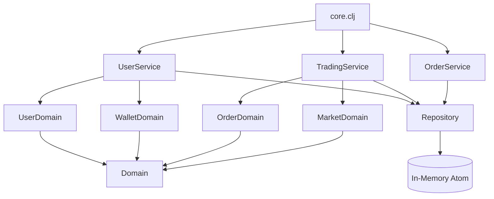

# Home Broker (Clojure) — Project Context Documentation

## 1. Overview

This project is a **Home Broker Simulator** implemented in **Clojure**, designed primarily for learning and experimentation with functional programming, idiomatic Clojure project structure, and domain modeling.

The system simulates a simplified stock trading environment where users can register, manage a cash balance, hold a portfolio of stocks, and execute buy and sell orders. There is no integration with a real stock exchange; all market behavior is simulated.

This document is intended to serve as **initial context for Large Language Models (LLMs)** assisting in the development of this project. It describes the project’s purpose, architecture, domain concepts, and component responsibilities.

---

## 2. Purpose and Goals

The main goals of this project are:

- Practice idiomatic Clojure design and namespace organization
- Model a financial trading domain using immutable data structures
- Separate domain logic, services, and state management
- Provide a clear, extensible baseline for future enhancements

Non-goals:

- Real-time trading
- Concurrency handling (initially)
- Real stock market integration
- Production-grade security or persistence

---

## 3. Architectural Style

The architecture follows a **functional core / imperative shell** approach:

- **Domain layer**: pure data structures and business rules
- **Service layer**: orchestration and use-case logic
- **Repository layer**: in-memory state (simulated persistence)
- **Core**: application entry point and manual flow execution

State is managed via a single `atom`, representing an in-memory database. No concurrency control is required at this stage.

---

## 4. High-Level Component Diagram

## 5. Main Components

### 5.1 User Registration

**Responsibility**
Manages user creation and initialization.

**Key Concepts**

* A user has a unique identifier and a name
* User creation also initializes a wallet with a cash balance

**Layer**

* Domain: user data structure
* Service: registration workflow
* Repository: stores users and wallets

---

### 5.2 Cash Balance

**Responsibility**
Represents the amount of money a user has available for trading.

**Key Concepts**

* Stored as a numeric value in the user’s wallet
* Updated during buy and sell operations
* Cannot go below zero

**Layer**

* Domain: wallet data
* Service: balance validation and updates

---

### 5.3 Stock Portfolio (Wallet)

**Responsibility**
Tracks the quantity of each stock symbol owned by a user.

**Key Concepts**

* Portfolio is a map of `symbol -> quantity`
* Only positive quantities are allowed
* Updated atomically with cash balance changes

**Layer**

* Domain: wallet structure
* Service: trading operations

---

### 5.4 Buy Stocks

**Responsibility**
Executes a simulated stock purchase.

**Rules**

* User must have sufficient cash balance
* Stock price is retrieved from the market simulator
* Cash balance decreases
* Stock quantity increases
* A buy order is recorded

**Layer**

* Service: trading-service
* Domain: order, market
* Repository: persistence of changes

---

### 5.5 Sell Stocks

**Responsibility**
Executes a simulated stock sale.

**Rules**

* User must own enough shares of the stock
* Stock price is retrieved from the market simulator
* Cash balance increases
* Stock quantity decreases
* A sell order is recorded

**Layer**

* Service: trading-service
* Domain: order, market
* Repository: persistence of changes

---

### 5.6 Order History

**Responsibility**
Stores and retrieves historical buy and sell orders.

**Key Concepts**

* Orders are immutable records
* Each order includes user, type, symbol, quantity, price, and timestamp
* Orders can be filtered by user

**Layer**

* Domain: order data
* Service: order querying
* Repository: order storage

---

### 5.7 Market and Pricing Rules

**Responsibility**
Simulates stock prices.

**Options**

* Fixed prices per symbol
* Randomized prices derived from a base value

**Constraints**

* No real market data
* No order book or matching engine

**Layer**

* Domain: market logic

---

## 6. Simplifying Assumptions

* No concurrency or parallel execution
* No authentication or authorization
* No persistence beyond in-memory state
* No network or API layer
* No transaction rollback mechanism

These assumptions are intentional to keep the focus on domain modeling and functional design.

---

## 7. Extensibility Notes

This design allows future extensions such as:

* Introducing concurrency with refs or STM
* Adding persistence (database or event sourcing)
* Exposing a REST or GraphQL API
* Supporting multiple markets or instruments
* Adding validation via clojure.spec or Malli

---

## 8. Summary

This  Home Broker project is a controlled, educational simulation that emphasizes clarity, immutability, and idiomatic Clojure practices. The architecture and domain separation are intentionally explicit to facilitate reasoning, testing, and incremental evolution, both by humans and by LLM-based assistants.
